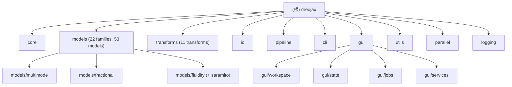

## graphify

This project has a knowledge graph at graphify-out/ with god nodes, community structure, and cross-file relationships.

Rules:
- For codebase questions, first run `graphify query "<question>"` when graphify-out/graph.json exists. Use `graphify path "<A>" "<B>"` for relationships and `graphify explain "<concept>"` for focused concepts. These return a scoped subgraph, usually much smaller than GRAPH_REPORT.md or raw grep output.
- If graphify-out/wiki/index.md exists, use it for broad navigation instead of raw source browsing.
- Read graphify-out/GRAPH_REPORT.md only for broad architecture review or when query/path/explain do not surface enough context.
- After modifying code, run `graphify update .` to keep the graph current (AST-only, no API cost).

---

# RheoJAX

> **Changelog**
> - 2026-07-17: Initial architect scan. Generated root + 8 module-level `CLAUDE.md` files and `.claude/index.json`. Corrected a stale project-memory claim about a dual GUI shell (see below).

## 项目愿景

RheoJAX 是一个 JAX 加速的统一流变学分析框架，将 53 个流变本构模型（22 个模型族）、11 种数据变换（傅里叶、TTS/SRFS 主曲线、SPP 分解等）、NLSQ 与贝叶斯（NumPyro NUTS）双轨拟合工作流，以及 PyQt/PySide6 交互式 GUI 整合到单一 scikit-learn 风格 API 中。核心约束：float64 精度强制、JIT 编译、GPU 加速优先，服务于科研级可重复性。

## 架构总览

- **`rheojax/core/`** — 抽象基类（`BaseModel`/`BaseTransform`）、`RheoData` 容器、参数系统、插件注册表（`Registry`/`ModelRegistry`/`TransformRegistry`）、NLSQ↔Bayesian 编排（`FitOrchestrator`）、NumPyro 模型构建与 ArviZ 诊断。所有其他模块依赖 core。
- **`rheojax/models/`** — 53 个模型，22 个子包（classical, fractional, flow, multimode, sgr, stz, fluidity(+saramito), dmt, spp, itt_mct, fikh, giesekus, tnt, vlb, ikh, hvm, hvnm, hl, epm）。每个模型继承 `BaseModel`，通过 `@ModelRegistry.register` 装饰器注册，懒加载（`__getattr__` + `_LAZY_IMPORTS`）避免 53 个模型的启动开销。
- **`rheojax/transforms/`** — 11 个数据变换（FFT、主曲线、SRFS、SPP 分解、Prony 转换等），通过 `@TransformRegistry.register` 注册，全部即时导入（无懒加载）。
- **`rheojax/io/`** — TRIOS/Anton Paar/CSV/Excel 读取器、HDF5/Excel/NPZ 写入器、SPP MATLAB 兼容导出、格式自动检测。
- **`rheojax/pipeline/`** — 流式 API（`Pipeline`、`BayesianPipeline`）、预置工作流（主曲线、模型比较、创变换）、`PipelineBuilder`、批处理 `BatchPipeline`。
- **`rheojax/cli/`** — `rheojax`/`rj` 命令行入口，子命令：fit/bayesian/spp/load/transform/export/run/pipeline/batch/info/inventory。YAML 流水线运行器与信封（envelope）JSON I/O。
- **`rheojax/gui/`** — PySide6 桌面应用（`rheojax-gui`/`rj-gui`），Redux 风格状态管理（`gui/state/`）、服务层（`gui/services/`）对接 rheojax API、后台 Worker（`gui/jobs/`）、`WorkspaceWindow`（唯一外壳，三步向导：fit/transform/pipeline）。
- **`rheojax/utils/`** — Mittag-Leffler 函数、Prony 级数、优化辅助（NLSQ 封装）、物理合理性检查、不确定度量化（bootstrap/Hessian CI）、GPU 设备检测、模型初始化启发式（`utils/initialization/`）。
- **`rheojax/parallel/`** — 进程级并行池（拟合/贝叶斯/批处理），线程仅用于 I/O；环境变量 `RHEOJAX_PARALLEL_WORKERS`/`RHEOJAX_SEQUENTIAL` 控制。
- **`rheojax/logging/`** — 结构化日志（context/formatters/handlers），供 core/cli/gui 统一使用。

### 关键设计约束（贯穿全仓）
- **Float64 强制**：`rheojax/__init__.py` 在导入 NLSQ 后显式 `jax.config.update("jax_enable_x64", True)`；内部模块必须通过 `safe_import_jax()`（`rheojax.core.jax_config`）导入 JAX，禁止直接 `import jax`。
- **懒加载**：`rheojax.models`、`rheojax.parallel.PersistentProcessPool`、根 `rheojax` 包的 `models` 属性均使用 `__getattr__` 懒加载，注册装饰器在首次访问时才触发；CLI/测试需要完整注册表时调用 `_ensure_all_registered()`。
- **NLSQ → NUTS 热启动**：贝叶斯工作流标准路径是 NLSQ 收敛后用其结果热启动 NUTS（见 `core/fit_orchestrator.py`、`core/numpyro_model_builder.py`）。
- **单一 GUI 外壳**：`WorkspaceWindow`（`gui/workspace/window.py`，三步向导 fit/transform/pipeline）是当前**唯一**的 GUI 入口。CHANGELOG `[Unreleased]` 记录了一次 BREAKING 变更：遗留 `RheoJAXMainWindow` 外壳与 `--legacy`/`--workspace` CLI 标志已被移除（此前项目 memory 记录的"双外壳"状态已过期，本次扫描已核实并更正，见 `rheojax/gui/CLAUDE.md`）。

## 模块结构图



## 模块索引

| 模块 | 路径 | 职责一句话 | 文件数 (src/test) | 文档 |
|------|------|-----------|-------------------|------|
| core | `rheojax/core/` | 基类、数据容器、注册表、拟合编排、贝叶斯诊断 | 17 / ~20 | [CLAUDE.md](./rheojax/core/CLAUDE.md) |
| models | `rheojax/models/` | 53 个流变本构模型，22 个模型族 | 105 / ~90 | [CLAUDE.md](./rheojax/models/CLAUDE.md) |
| transforms | `rheojax/transforms/` | 11 个数据分析变换（FFT/主曲线/SPP 等） | 12 / 14 | [CLAUDE.md](./rheojax/transforms/CLAUDE.md) |
| io | `rheojax/io/` | 文件读写（TRIOS/Anton Paar/CSV/Excel/HDF5）+ SPP 导出 | 27 / 23 | [CLAUDE.md](./rheojax/io/CLAUDE.md) |
| pipeline | `rheojax/pipeline/` | 流式拟合/变换工作流 API | 6 / 16 | [CLAUDE.md](./rheojax/pipeline/CLAUDE.md) |
| cli | `rheojax/cli/` | `rheojax`/`rj` 命令行工具 | 17 / 17 | [CLAUDE.md](./rheojax/cli/CLAUDE.md) |
| gui | `rheojax/gui/` | PySide6 桌面应用（`rheojax-gui`） | 115 / 119+ | [CLAUDE.md](./rheojax/gui/CLAUDE.md) |
| utils | `rheojax/utils/` | 数值工具、优化、初始化、不确定度量化 | 33 / 30 | [CLAUDE.md](./rheojax/utils/CLAUDE.md) |
| parallel | `rheojax/parallel/` | 进程池并行执行 | 4 / 8 | [CLAUDE.md](./rheojax/parallel/CLAUDE.md) |
| logging | `rheojax/logging/` | 结构化日志配置 | 6 / 4 | [CLAUDE.md](./rheojax/logging/CLAUDE.md) |

## 运行与开发

```bash
uv sync                                  # 安装依赖（更新 uv.lock）
uv run python -m rheojax.cli.main info   # 验证安装 / float64 / 设备
uv run rheojax fit data.csv --model maxwell --x-col time --y-col G_t
uv run rheojax-gui                       # 启动 GUI
uv run pytest                            # 运行测试（testpaths=tests, --cov=rheojax）
uv run ruff check .                      # Lint
uv run mypy .                            # 类型检查（gui/cli 模块 mypy 忽略错误，见 pyproject.toml）
uv run sphinx-build docs/source docs/_build
```

GPU 加速：默认 CPU-only；`make install-jax-gpu`（自动检测 CUDA 12/13）或 `pip install "rheojax[gpu_cuda13|gpu_cuda12]"`。禁止同时安装 cuda12 与 cuda13 插件。

## 测试策略

- **测试树**：`tests/` 镜像 `rheojax/` 结构（`tests/core`, `tests/models/<family>`, `tests/gui/...`, `tests/cli`, `tests/pipeline`, `tests/utils`, `tests/parallel`, `tests/transforms`, `tests/io`）。
- **分层标记**：`smoke`（<2min 关键用例）、`unit`（默认层）、`integration`、`validation`（对照 pyrheo/hermes-rheo）、`benchmark`。
- **执行特性标记**：`slow`、`gpu`、`macos_only`、`crash_test`（子进程崩溃检测）。
- **pytest 配置**：`--dist=loadgroup`（保留 NUTS 密集测试的 xdist_group 隔离）、`--timeout=120`、`--maxfail=10`。
- **GUI 测试**：可通过缺失 PySide6 跳过（`gui` marker）；含视觉回归（golden images, `visual` marker）与崩溃防护测试。
- 已知历史缺陷：`tests/core/test_base.py` 存在重复 `TestBaseModel` 类导致后一个类遮蔽前一个约 600 行测试从未运行——保留未修复（见项目 memory）。

## 编码规范

- Python 3.12+，`uv` 管理依赖；`ruff`（line-length 88, 规则集 E/W/F/I/C/B/UP/S）+ `mypy`（`rheojax.gui.*`/`rheojax.cli.*` 因 PySide6 桩问题被忽略错误）。
- JAX-first：最小化 Host↔Device 传输；内部一律用 `safe_import_jax()`，禁止 `import jax` 直连。
- 禁止非 JIT 安全插值（用 `interpax` 替代 `scipy.interpolate`）；ODE 求解用 `diffrax` 而非 `jax.experimental.ode`。
- 贝叶斯：NumPyro 优先，NLSQ 热启动 → NUTS，ArviZ 强制诊断（R-hat, ESS, BFMI）；本仓库仅针对 arviz 1.x（`arviz-base`/`arviz-stats`/`arviz-plots` 拆分，见 `core/arviz_utils.py` 的 kwarg 转换 shim）。
- GUI 逻辑与数值计算解耦：PySide6 仅做 View 层，数值逻辑留在 JAX 侧。

## AI 使用指引

- 修改代码前先查 `graphify-out/`（见文首 graphify 规则）。
- 不要在 `rheojax/models/*.py`、`rheojax/utils/mittag_leffler.py`、`rheojax/utils/initialization/*.py`、`rheojax/transforms/*.py` 中把 `import` 语句重排到 `safe_import_jax()` 之前（ruff 对这些路径放宽了 E402 是有意为之）。
- `CLAUDE.md` 与 `.claude/` 已被 `.gitignore` 忽略（见 `.gitignore` 第 200/211 行）——本次生成的所有文档均为未跟踪文件，不会出现在 `git status` 的常规 diff 中。
- 新增模型：在对应模型族目录下创建文件，继承 `BaseModel`，用 `@ModelRegistry.register` 注册，并在 `rheojax/models/__init__.py` 的 `_LAZY_IMPORTS` 表中添加懒加载映射。
- 新增变换：继承 `BaseTransform`，用 `@TransformRegistry.register` 注册，在 `rheojax/transforms/__init__.py` 顶层直接 import（变换不使用懒加载）。
- GUI 相关任务不要假设存在 `--legacy`/`RheoJAXMainWindow` 路径——已在 `[Unreleased]` 移除，只有 `WorkspaceWindow` 一条路径。

## 变更记录 (Changelog)

- 2026-07-17T00:00:59 — 初始化架构扫描（阶段 A-D 全部完成）。生成根 `CLAUDE.md`、8 个模块级 `CLAUDE.md`（core/models/gui/io/cli/pipeline/utils/parallel）与 `.claude/index.json`。`transforms`/`logging` 因任务范围未生成独立模块文档，已在根文档架构总览中说明。发现并更正一处过期的项目 memory 记录：GUI 曾有"默认 `WorkspaceWindow` + 遗留 `RheoJAXMainWindow --legacy`"的双外壳描述，经 grep 全仓源码 + 读取 `CHANGELOG.md` `[Unreleased]` 确认遗留外壳与 `--legacy`/`--workspace` 标志已作为 BREAKING CHANGE 移除，现仅有单一外壳。

## Agent skills

### Issue tracker

Issues live as GitHub issues (repo: `imewei/rheojax`), via the `gh` CLI. See `docs/agents/issue-tracker.md`.

### Triage labels

Default five-role vocabulary (`needs-triage`, `needs-info`, `ready-for-agent`, `ready-for-human`, `wontfix`), unmapped. See `docs/agents/triage-labels.md`.

### Domain docs

Single-context — one `CONTEXT.md` + `docs/adr/` at the repo root (neither exists yet; created lazily). See `docs/agents/domain.md`.
